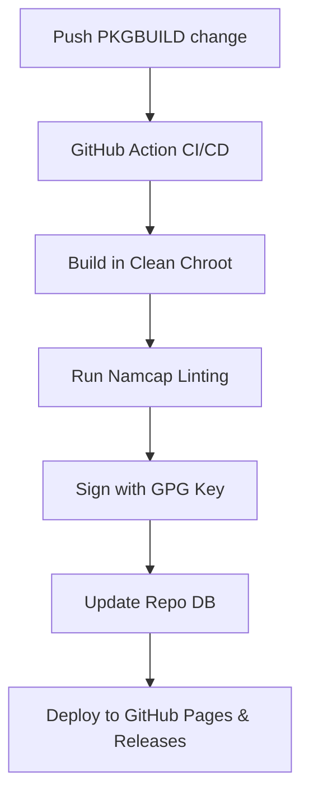

# Plan Alignment Report (PLAN-ALIGNMENT-REPORT.md)

This report benchmarks the current **ZarchBlack** repository architecture against industry standards and outlines the architectural changes required to align with professional distribution systems.

---

## 1. Benchmarking Report

### 1.1 Arch Packaging Standards
* **Arch Linux Standard:** All official Arch packages are built in clean chroots to guarantee reproducibility. Packages must pass `namcap` validation to ensure correct dependencies and directory permissions. All repository databases and packages must be signed with a trusted packager GPG key.
* **ZarchBlack Alignment:** Currently non-compliant. Builds are done on the host system without sandboxing, GPG signing is disabled, and no automated validation is in place.

### 1.2 Manjaro Repository System Model
* **Manjaro Model:** Uses a staged branch model (Unstable -> Testing -> Stable) to filter bugs before reaching users. They manage package building via custom build servers and distribute mirrors globally.
* **ZarchBlack Alignment:** Too complex for a lean team. ZarchBlack should focus on a direct Stable branch (with a local staging mechanism) rather than hosting multiple remote stages, keeping infrastructure costs at zero by using GitHub Pages.

### 1.3 EndeavourOS CI/CD Structure
* **EndeavourOS Model:** Uses GitHub Actions to build packages. When a `PKGBUILD` is modified and pushed, GitHub Actions spawns an Arch Linux runner, builds the package in a clean chroot via `devtools`, signs the package with a GPG key stored in repository secrets, updates the database, and deploys it to a static files server or GitHub Releases.
* **ZarchBlack Alignment:** This is the **ideal model** for ZarchBlack. It leverages free GitHub runner minutes, ensures secure GPG signing, and automates repository hosting on GitHub Pages and Releases.

---

## 2. Structural Realignment Plan

| Action | Component | Description / Rationale |
| :--- | :--- | :--- |
| **KEEP** | `packages/` | The directory of PKGBUILDs is correct. It keeps our recipe source code organized. |
| **KEEP** | `kde-releng/` | The Archiso build configuration, profile, and customization files. |
| **MODIFY** | `local-repo/` | Rename to `repo/` and restructure to separate local test builds from the final production repo database. |
| **MODIFY** | `pacman.conf` (ISO) | Modify to enforce GPG signature checks (`SigLevel = Required DatabaseOptional`). |
| **REMOVE** | Redundant scripts | Delete `local-repo/update-repo.sh` and `/home/zarch/zarchblack_iso/scripts/update-repo.sh` in favor of a single automated build system. |
| **ADD** | `.github/workflows/` | GitHub Actions workflow to build packages in clean chroots, sign them, and push to the release server. |
| **ADD** | `keys/` | Local public keyring to verify signed packages during local test installations. |
| **ADD** | `build/` | Standard directory for temporary chroot builds. |

---

## 3. High-Level Implementation Steps (Post-Approval)

1. **Step 1:** Reorganize folder structures.
2. **Step 2:** Generate GPG Key pairs and configure them as GitHub secrets.
3. **Step 3:** Implement the Clean Chroot build workflow using a GitHub Action (using actions like `pkgbuild-action` or a customized container build).
4. **Step 4:** Securely automate repository database additions and signing.
5. **Step 5:** Integrate the secure GPG verification into the ZarchBlack ISO build.
