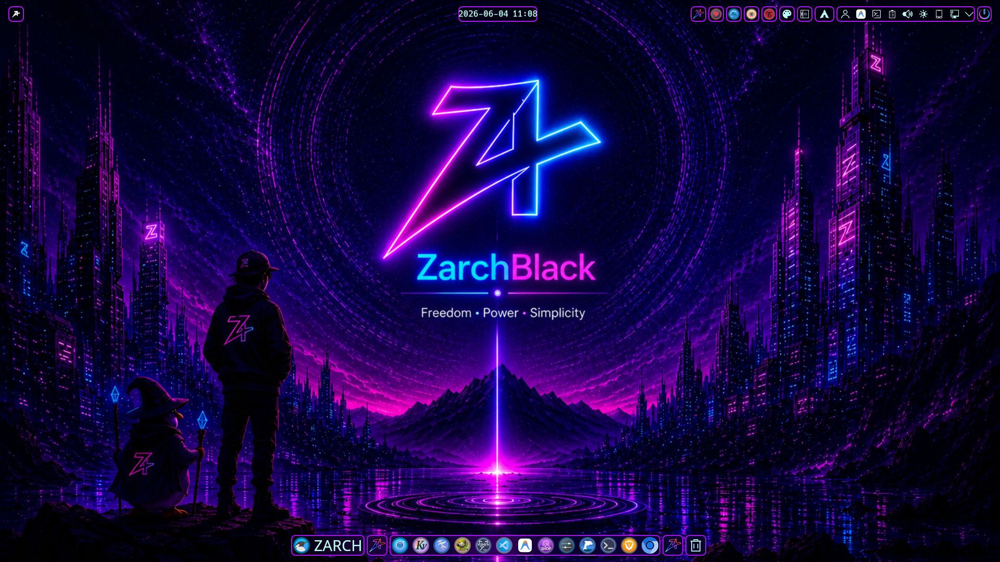

# ZarchBlack Official Repository 🌌

<p align="center">
  
</p>

<p align="center">
  <a href="https://github.com/ZarchBlack/zarchblack-repo/actions/workflows/shellcheck.yml">
    
  </a>
  <a href="https://github.com/ZarchBlack/zarchblack-repo/releases/latest">
    
  </a>
  <a href="https://zarchblack.pages.dev/">
    
  </a>
  
  
  
  
</p>

<p align="center">
  <a href="https://zarchblack.pages.dev/">
    
  </a>
  <a href="https://huggingface.co/datasets/zarchblack/zarchblack-releases/tree/main">
    
  </a>
  <a href="https://github.com/ZarchBlack/zarchblack-repo/releases">
    
  </a>
  <a href="https://github.com/ZarchBlack/zarchblack-repo/issues">
    
  </a>
</p>

---

## 🌟 About ZarchBlack

**ZarchBlack** is a modern, cutting-edge Linux distribution based on **Arch Linux**, engineered specifically for developers, programmers, cybersecurity specialists, ethical hackers, system administrators, and advanced Linux enthusiasts.

More than just a standard Arch Linux spin, ZarchBlack delivers a fully optimized, secure, and visually stunning operating system. It comes equipped with a custom-crafted **KDE Plasma 6** desktop environment running natively on **Wayland** that strikes a perfect balance between power, beauty, and security.

### 🖼️ Preview ZarchBlack
<p align="center">
  
</p>

---

## 🎨 The Passion & Story Behind ZarchBlack

ZarchBlack is developed and maintained by **Zero7x**, a passionate Moroccan developer. Zero7x did not formally study programming or software development; instead, this distribution is the product of pure self-learning, curiosity, and a deep-seated passion for Linux — especially Arch Linux.

Building ZarchBlack required months of intense, daily effort, troubleshooting countless compilation errors, refining configurations, and repeatedly rebuilding the ISO to get everything perfect. Every detail, from the massive, high-quality, hand-selected wallpaper collection to the stunning themes and icons, was crafted with care to offer a desktop experience never seen in any other 2026 distribution.

Rather than just testing on virtual machines, ZarchBlack was rigorously tested and verified directly on **physical hardware and real storage drives** to guarantee maximum performance, stability, and reliability on bare metal.

---

## 🛠️ Specialized Custom Utilities

ZarchBlack features three unique, built-in applications:

### 1. `zarch-hacking` 🥷
* **BlackArch Integration:** Instant access to 2000+ security and penetration testing tools.
* **Categorized Security Tools:** Search and install security software grouped by field.
* **Isolated Testing:** Sandbox environments to evaluate programs securely.

<p align="center">
  
</p>

### 2. `zarchguard` 🛡️
* **Smart System Updates:** Safe rolling-release updates with automated pre-checks.
* **Deep Clean:** Clean package cache, logs, old configs, and orphaned files.
* **Maintenance & Repair:** Automated diagnostics and quick-fixing scripts.

### 3. `zpackagemanager` 📦
* **Intuitive Package Management:** Powerful CLI to install, remove, and manage packages.
* **Repository Control:** Seamlessly enable, disable, and configure repositories.
* **Dependency Resolver:** Handles AUR and custom repository package dependencies.

---

## 🚀 Key Features

* **Native Wayland Desktop:** KDE Plasma 6 on Wayland by default (X11 fallback available).
* **Power & Performance:** Full **CachyOS** repositories with CPU-optimized kernels and performance tweaks.
* **Security Out of the Box:** Pre-configured `firewalld`, `ufw`, `firejail`, and **KDE Connect** (with persistent firewall rules).
* **Stunning Visuals:** **Darkly** theme, **Layan** window decorations, **Catppuccin Mocha Lavender** color scheme, and custom ZarchBlack icons.
* **Massive Wallpaper Collection:** Hundreds of carefully curated wallpapers.
* **Custom Music Toolbar:** `plasma6-applets-plasmusic-toolbar` pre-installed for a premium panel experience.

---

## 🧰 Pre-installed Software

### 1. Terminal & CLI Productivity
* **Modern Replacements:** `eza`, `bat`, `ripgrep`, `fd`, `dust`, `duf`
* **Prompts & Fun:** `starship`, `oh-my-posh`, `linuxtoys-bin`
* **Shells & Emulators:** `fish`, `kitty`, `alacritty`, `yakuake`
* **Monitoring:** `btop`, `htop`, `nvtop`, `nmon`
* **Multiplexers & File Managers:** `tmux`, `ranger`, `lf`

### 2. Pre-installed Browsers
* `Brave` (`brave-origin`) and `Thorium` — fast, private, and ready out of the box.

### 3. Development & Security Tools
* **Development:** `vim`, `gcc`, `cmake`, `git`, `opencode-desktop`
* **Security:** `nmap`, `tcpdump`, `apparmor`, `firejail`, `audit`, `earlyoom`

### 4. Productivity & Multimedia
* **Office & Design:** `LibreOffice`, `GIMP`, `Krita`, `Calibre`
* **Video & Audio:** `OBS Studio`, `VLC`, `Audacity`, `Kdenlive`
* **Password Management:** `KeePassXC`

### 5. Recovery & System Management
* **Snapshots:** `timeshift` with BTRFS support
* **Data Recovery:** `testdisk`, `ddrescue`, `clonezilla`
* **Installer:** `Calamares` for a smooth installation experience

---

## 📦 Add ZarchBlack Repository to Any Arch System

If you are already running Arch Linux or any Arch-based distribution, you can install ZarchBlack's exclusive packages by adding our repository:

### 1. Edit `/etc/pacman.conf`
```bash
sudo nano /etc/pacman.conf
```

### 2. Append the ZarchBlack Repository
```ini
[zarchblack-repo]
SigLevel = Required DatabaseOptional
Server = https://github.com/ZarchBlack/zarchblack-repo/releases/download/repo
```

### 3. Sync and Install
```bash
sudo pacman -Sy
sudo pacman -S zarch-hacking zarchguard zpackagemanager
```

---

## 🏗️ For Developers & Contributors

### Build Requirements
| Requirement | Version |
|---|---|
| `archiso` | latest |
| `git` | latest |
| OS | Arch Linux (physical or VM) |
| RAM | 8 GB minimum |
| Disk | 30 GB free space |

### Project Structure
```text
zarchblack_iso/
├── iso/                  # archiso profile (ISO build configuration)
│   ├── airootfs/         # Files overlaid on the live system root
│   ├── packages.x86_64   # Complete package list
│   └── profiledef.sh     # ISO profile definition
├── packages/             # PKGBUILD sources for all custom packages
├── branding/             # Calamares, GRUB, SDDM, Plymouth themes
├── configs/              # KDE, GTK, shell, system configuration files
├── plasma/               # Plasma themes, color schemes, Kvantum
├── themes/               # Icon themes, cursors
├── scripts/              # Build and maintenance scripts
└── .github/
    ├── workflows/        # GitHub Actions CI/CD
    └── ISSUE_TEMPLATE/   # Bug report & feature request templates
```

### Building the ISO Locally
```bash
# Clone the repository
git clone https://github.com/ZarchBlack/zarchblack-repo.git
cd zarchblack-repo/zarchblack_iso

# Clean previous builds and build a fresh ISO
sudo rm -rf out/* work/
sudo ./scripts/build-iso.sh clean
```
> The built ISO will be placed in the `out/` directory.

---

## 📅 Releases & Versioning

Releases are tagged using the `vYYYY.MM.DD` scheme. Each release includes:
- The ISO file (hosted on HuggingFace due to size)
- SHA256 checksum file
- Release notes with a full list of changes

### Latest Releases

| Version | Date | Download | Checksum |
|---|---|---|---|
| [v2026.07.07](https://github.com/ZarchBlack/zarchblack-repo/releases/tag/v2026.07.07) | 2026-07-07 | [HuggingFace](https://huggingface.co/datasets/zarchblack/zarchblack-releases/tree/main) | See release page |

See [CHANGELOG.md](CHANGELOG.md) for a full history of changes.

---

## 🌐 Community & Support

| Platform | Link |
|---|---|
| 🌐 Official Website | [zarchblack.pages.dev](https://zarchblack.pages.dev/) |
| 🐛 Bug Reports | [GitHub Issues](https://github.com/ZarchBlack/zarchblack-repo/issues) |
| 📖 Changelog | [CHANGELOG.md](CHANGELOG.md) |
| 🔒 Security | [SECURITY.md](SECURITY.md) |
| 🤝 Contributing | [CONTRIBUTING.md](CONTRIBUTING.md) |

---

*ZarchBlack is licensed under the **GPLv3 License**. Maintained with passion by **Zero7x** and the open-source community.*
